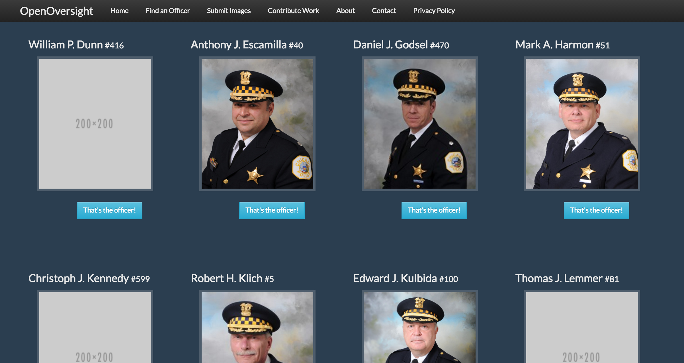

# OpenOversight

OpenOversight is a Lucy Parsons Labs project to improve police accountability through public and crowdsourced data. We maintain a database of police officer demographic information and provide digital galleries of photographs to help people identify police officers they would like to file a complaint on.

As a proof of concept, OpenOversight currently uses the Chicago Police Department but this infrastructure will be used to extent the project to other cities where it is needed. Interested in helping bring OpenOversight to your city? Email us at [info@lucyparsonslabs.com](mailto:info@lucyparsonslabs.com).  

This project is written and maintained by [@lucyparsonslabs](https://twitter.com/lucyparsonslabs.com) with collaboration, partnerships, and contributions welcome. If you would like to contribute code or documentation, please see our contributing guide. If you prefer to contribute in other ways, please submit images to our platform or use our crowd-sourced human labeling tool to help build training datasets.

## Note to Law Enforcement

To Illinois law enforcement: This project does not perform facial recognition and is thus in compliance with the Biometric Information Privacy Act. Requests/questions regarding this project from those affiliated with law enforcement should be directed to our legal representation at [legal@lucyparsonslabs.com](mailto:legal@lucyparsonslabs.com).

## Issues

Please use [our issue tracker](https://github.com/lucyparsons/OpenOversight//issues/new) to submit issues or suggestions. 

## Technologies 

 * We use Python 2.7 as we have deps not yet Python 3 compatible 
 * Face detection: openface, opencv
 * Web frontend: Flask, WTForms for input validation
 * Database backend: psycopg2, PostgreSQL
 * ETL toolchain: pandas, sqlalchemy

## Components

* `OpenOversight`: digital gallery web application 
* `socmint`: scripts for gathering images from social media, currently just official police accounts
* `etl` and `database`: scripts for taking primarily data dumps from FOIA and other organizations, cleaning them, and uploading them into our database

# Installation

Please see the `DEPLOY.md` file for installation instructions.

## Data Collection

* Public datasets: Download recently tweeted photos from official police accounts. 
* Linking dataset: In order to provide identities of officers, we need the roster of all police officers as well as their star number history (if star numbers change upon promotion). 
* Solicitation from our users: Get users to submit images of police officers they take or find online to augment our training data.
* Officer activity information: TODO acquire through FOIA
