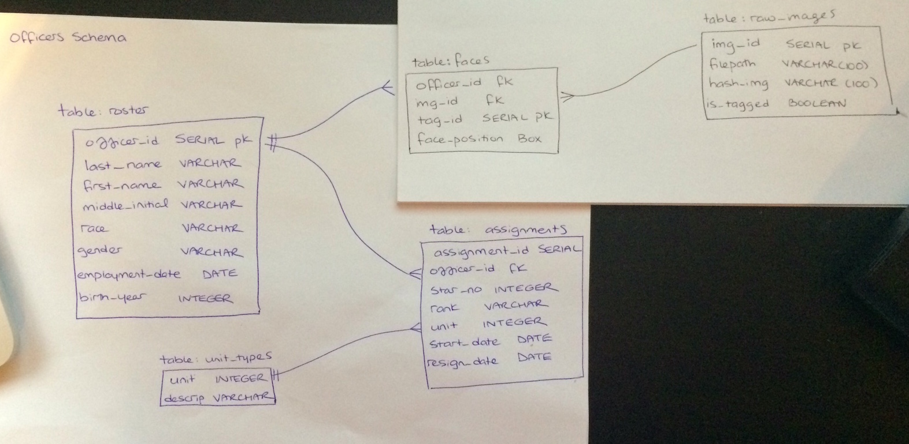

# Database Setup

## Schema/Table Creation

Tables should be created in this order due to foreign key constraints:

```
psql -f create_officer_schema.sql
psql -f create_officer_roster.sql
psql -f create_table_raw_images.sql
psql -f create_officer_faces.sql
psql -f create_officer_assignments.sql
psql -f create_officer_unit_types.sql
```

## Database Diagram



(if you want to nicely typeset this please do - and ideally in a way that enables us to easily make edits (e.g. LaTeX or graphviz))

## Populating from Raw Data

Everything here assumes that you executed the ETL scripts in `etl` to load the raw data into `public`. Once you've done that you can get the data into the form that the webapp expects using the following scripts:

```
psql -f populate_officer_roster.sql
psql -f populate_officer_assignments.sql
psql -f populate_officer_unittypes.sql
```

Tables `faces` and `raw_images` are empty until rows are added by taggers and uploaders respectively. 