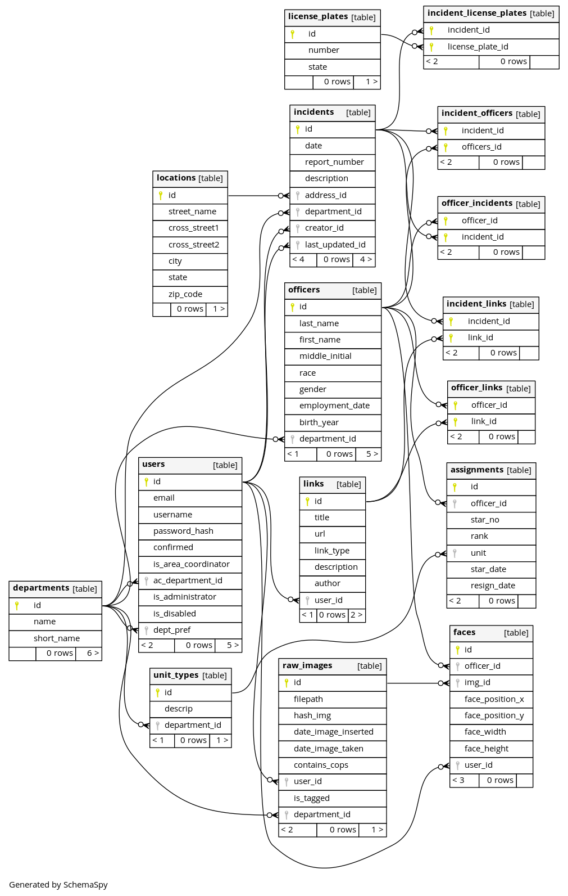

# Database Setup

## Schema/Table Creation

Create with `OpenOversight/create_db.py`

## Database Diagram



See more detailed database schema information [here](https://disman.tl/oo-docs/).

## Populating from Raw Data

Everything here assumes that you executed the ETL scripts in `etl` to load the raw data into `public`. Once you've done that you can get the data into the form that the webapp expects using the following scripts:

```
psql -f populate_officer_roster_and_assignment.sql
```

Note: the remaining SQL scripts in here are deprecated
